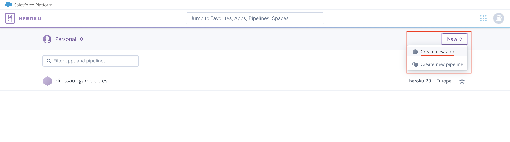
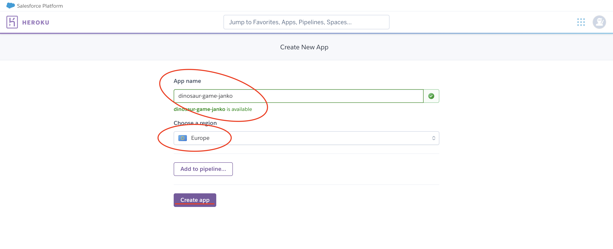
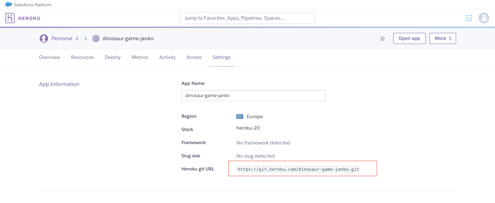
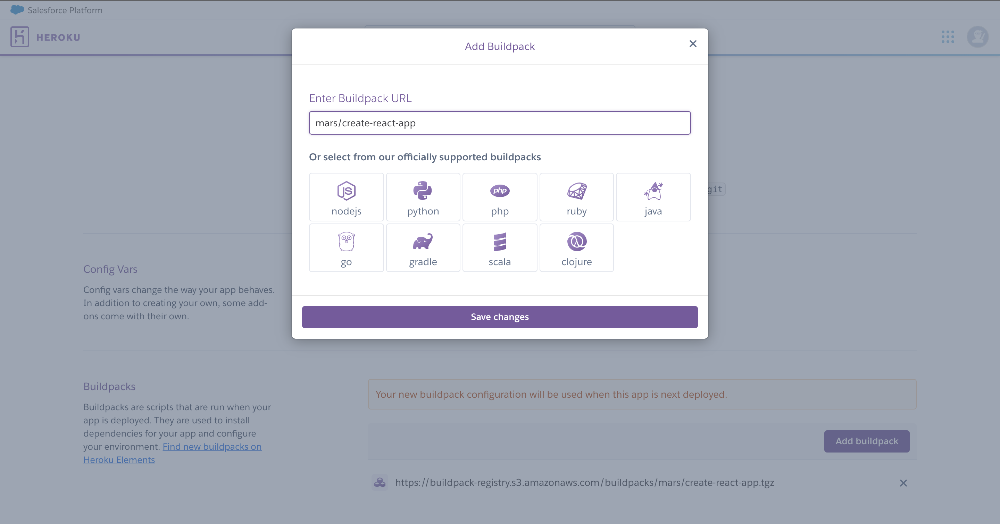

# Le jeu du T-Rex

## Etape 5

Vous voilà maintenant avec un début de projet sur `master`, vous pouvez dès à présent le tester sur Heroku.
Pour cela vous devez d'abord vous créer un compte sur heroku et suivre la démarche ci-dessous :

1. Créer son compte sur https://id.heroku.com/login
2. Créer une nouvelle app nommée `dinosaur-game-<votre_nom_ou_surnom>`





3. Aller dans Settings en copier l'url du répo git



4. Configurer le buildpack `mars/create-react-app`



5. Installer la CLI Heroku https://devcenter.heroku.com/articles/heroku-cli


Nous allons maintenant ajouter la remote `heroku` à notre projet. 
Heroku est un service cloud qui permet de lancer des serveurs automatiquement en pushant son code sur les repositories de Heroku. Il s'utilise principalement avec Git et permet de tester facilement ses plateformes, voir de faire des environnements pour chaque développeurs, pour chaque branche et chaque personne qui souhaite tester une application web.


```bash
    git remote add heroku <url>
    heroku login
    git push heroku feature/heroku:master
```

La commande va rater, puisque pour le moment vous n'êtes pas à jour avec le travail d'Armande. 
Pour cela, vous pouvez faire un rebase avec `master` pour déplacer votre branche après le merge fait à l'étape 4.

```bash
    git rebase master
    git push heroku feature/heroku:master
```

Après quelques minutes vous pouvez alors ouvrir votre navigateur à l'URL qui s'affiche dans votre console.
